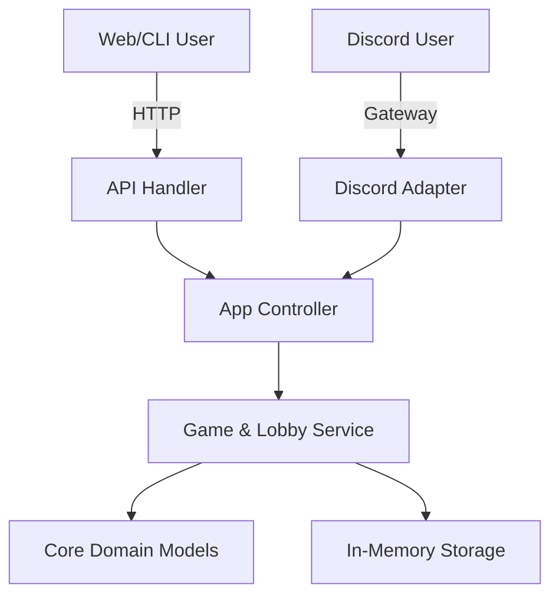

# Battleship Server

A robust, multi-platform Battleship game server written in Go.

## Overview

This project implements a HEXAGONAL implementation of the classic Battleship game, designed to support multiple client interfaces simultaneously:

- **Discord Bot**: Direct integration with Discord's API for playing within chat.
- **Web Interface**: A modern web GUI communicating via REST API.
- **CLI Client**: A command-line interface communicating via REST API.

The architecture strictly separates the **Core Domain** (Game Logic) from the **Primary Adapters** (HTTP, Discord), ensuring consistent rules and state validation across all platforms.

### Security

- **Authentication**: JWT (JSON Web Token) based.
  1. `POST /login` with username to receive a token.
  2. Send `Authorization: Bearer <token>` header for all protected endpoints.
- **Timeouts**: Strict read/write/idle timeouts to prevent Slowloris attacks.
- **Rate Limiting**: 20 requests/second per IP.
- **Security Headers**: HSTS, X-Frame-Options, X-XSS-Protection enabled.

### System Limits & Policies

- **Max Active Games**: Each user is limited to **5 active games** to prevent resource exhaustion.
- **Game Cleanup**:
  - **Finished Games**: Removed 10 minutes after completion.
  - **Stale Games**: Removed 24 hours after the last activity.

## Architecture



- **`internal/model`**: Pure domain logic (Board, Game, Ship, Rules). Zero dependencies.
- **`internal/service`**: Business logic, state management, and storage.
- **`internal/controller`**: Use-case orchestration. This is the **Shared Entry Point** for all platforms.
- **`internal/api`**: HTTP Adapter (Echo) for Web/CLI clients.
- **`internal/bot`** (Future): Discord Adapter using `discordgo`.

## Getting Started

### Prerequisites

- **Go**: Version 1.25 or higher.
- **Make**: For running utility commands.

### Running the Server

To start the server locally (currently HTTP only):

```bash
make run
```

The server will start on port `8080`.

- **API Base URL**: `http://localhost:8080`
- **API Documentation**: [docs/openapi.yaml](docs/openapi.yaml)
- **Game Specification**: [docs/spec.md](docs/spec.md)
- **Project Roadmap**: [docs/roadmap.md](docs/roadmap.md)

## Development

### Live Reload

For a better development experience, we use [Air](https://github.com/air-verse/air) to automatically reload the server on code changes.

1. **Install Air**:

   ```bash
   go install github.com/air-verse/air@latest
   ```

2. **Run with Air**:
   ```bash
   air
   ```

### Running Tests

We use `make` to run tests and generate coverage reports. The `test` target automatically excludes generated mocks from the coverage statistics.

```bash
make test
```

### End-to-End Testing

The project includes specific E2E scenarios to verify full game loops. These are located in `cmd/server/e2e_test.go` and currently simulate the HTTP flow.

## Deployment

### Docker

You can package and run the application using Docker.

**Build the image**:

```bash
make docker-build
```

**Run the container**:

```bash
make docker-run
```

Only the application binary is included in the final image (Distroless), keeping it lightweight and secure.

## CI/CD Service

This repository uses **GitHub Actions** for Continuous Integration and Delivery.

- **CI (`.github/workflows/ci.yml`)**:

  - Validates code formatting/linting using `golangci-lint`.
  - Runs all unit and integration tests with race detection.
  - Verifies that the server binary compiles.
  - Triggered on every Push and Pull Request to `main`.

- **Release (`.github/workflows/release.yml`)**:
  - Automatically creates a new Release when a tag starting with `v` (e.g., `v1.0.0`) is pushed.
  - Uses [GoReleaser](https://goreleaser.com/) to build binaries for Linux, macOS, and Windows.
  - Uploads artifacts directly to the GitHub Release page.
