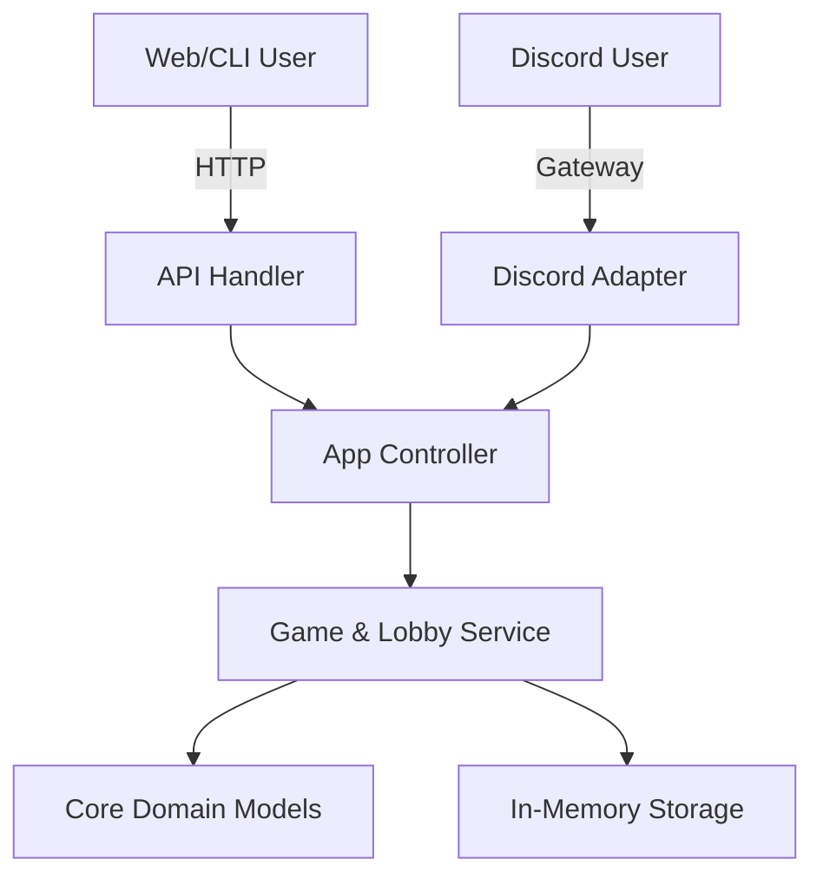

# Battleship Server

A robust, multi-platform Battleship game server written in Go.

## Overview

This project implements a HEXAGONAL implementation of the classic Battleship game, designed to support multiple client interfaces simultaneously:

- **Discord Bot**: Direct integration with Discord's API for playing within chat.
- **Web Interface**: A modern web GUI communicating via REST API.
- **CLI Client**: A command-line interface communicating via REST API.

The architecture strictly separates the **Core Domain** (Game Logic) from the **Primary Adapters** (HTTP, Discord), ensuring consistent rules and state validation across all platforms.

## Architecture



- **`internal/model`**: Pure domain logic (Board, Game, Ship, Rules). Zero dependencies.
- **`internal/service`**: Business logic, state management, and storage.
- **`internal/controller`**: Use-case orchestration. This is the **Shared Entry Point** for all platforms.
- **`internal/api`**: HTTP Adapter (Echo) for Web/CLI clients.
- **`internal/bot`** (Future): Discord Adapter using `discordgo`.

## Getting Started

### Prerequisites

- **Go**: Version 1.25 or higher.
- **Make**: For running utility commands.

### Running the Server

To start the server locally (currently HTTP only):

```bash
go run cmd/server/*.go
```

The server will start on port `8080`.

- **API Base URL**: `http://localhost:8080`
- **API Documentation**: [docs/openapi.yaml](docs/openapi.yaml)
- **Game Specification**: [docs/spec.md](docs/spec.md)

## Development

### Running Tests

We use `make` to run tests and generate coverage reports. The `test` target automatically excludes generated mocks from the coverage statistics.

```bash
make test
```

### End-to-End Testing

The project includes specific E2E scenarios to verify full game loops. These are located in `cmd/server/e2e_test.go` and currently simulate the HTTP flow.
