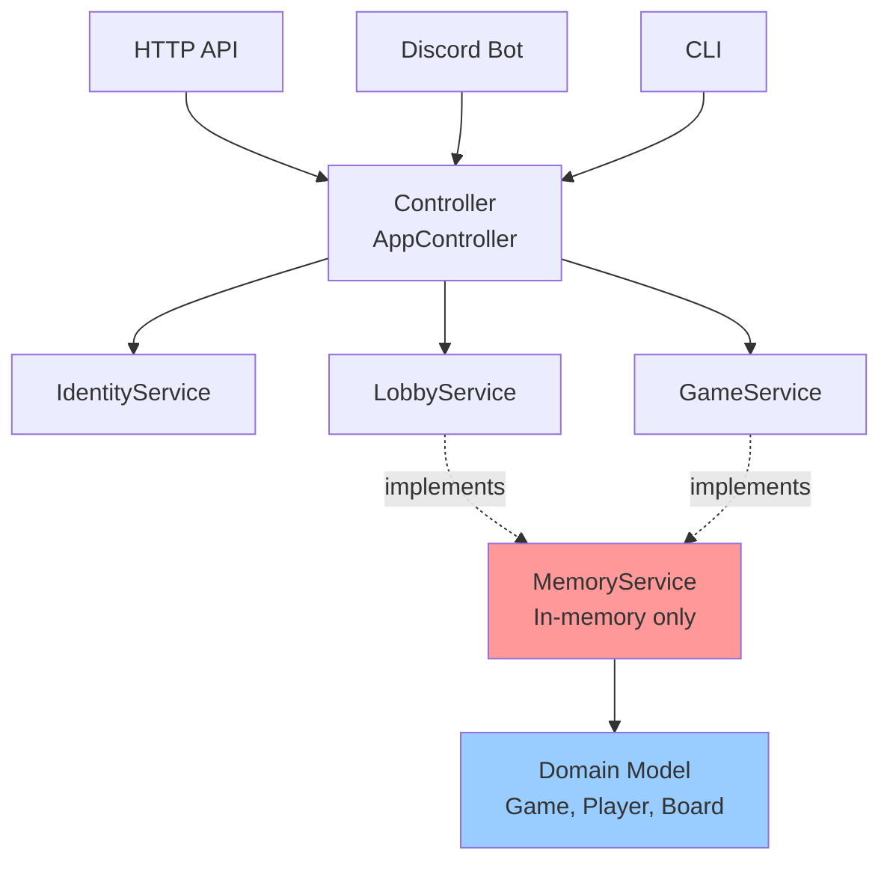
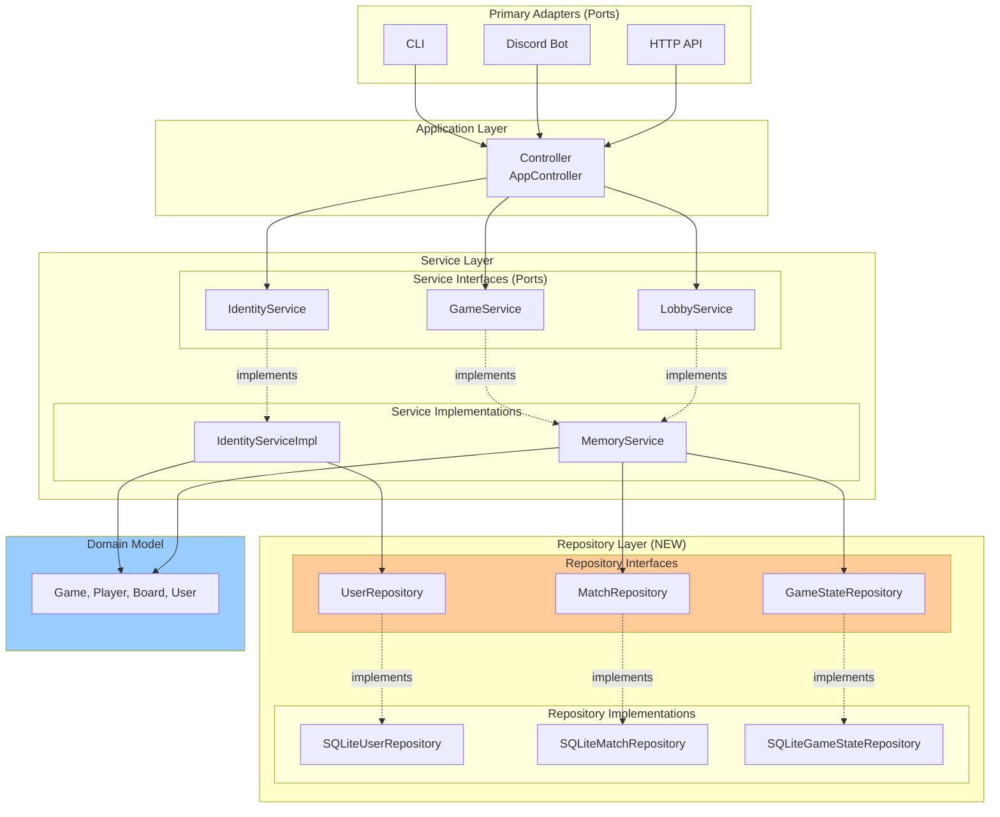
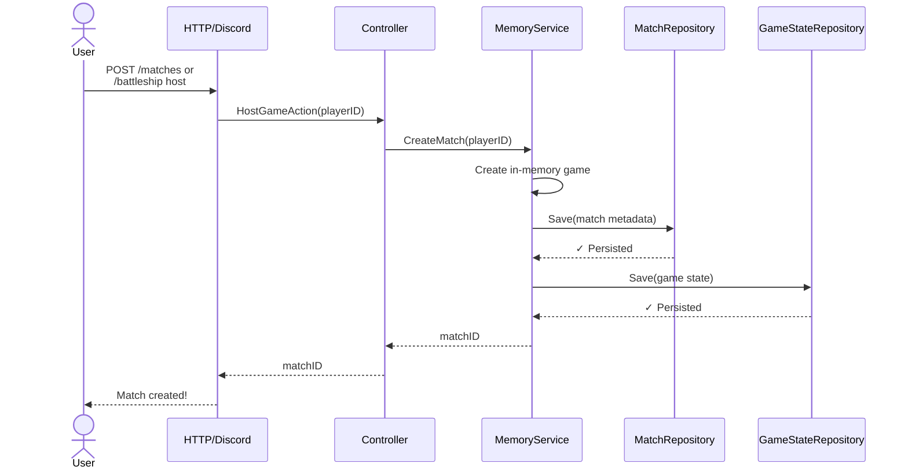
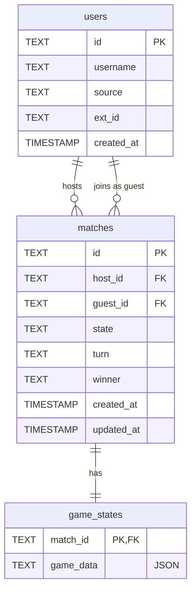

# Persistence Layer Architecture Design

## Overview

This document outlines the architecture for adding persistence to the Battleship application while maintaining hexagonal architecture and clean code principles.

## Current Architecture



## Proposed Persistence Architecture



## Design Principles

### 1. Dependency Inversion

- Services depend on **repository interfaces**, not implementations
- Repositories can be swapped without changing service code
- Domain model has no dependencies on infrastructure

### 2. Single Responsibility

- **Repositories**: Only handle data persistence/retrieval
- **Services**: Business logic and orchestration
- **Domain**: Game rules and validation

### 3. Interface Segregation

- Separate repositories for Users, Matches, and GameState
- Each repository has focused, minimal interface

## Repository Interfaces

### `internal/repository/repository.go`

```go
// UserRepository handles user persistence
type UserRepository interface {
    Save(ctx context.Context, user *dto.User) error
    FindBySourceAndExtID(ctx context.Context, source, extID string) (*dto.User, error)
    FindByID(ctx context.Context, id string) (*dto.User, error)
}

// MatchRepository handles match metadata
type MatchRepository interface {
    Save(ctx context.Context, match *Match) error
    FindByID(ctx context.Context, id string) (*Match, error)
    ListActive(ctx context.Context) ([]*Match, error)
    Delete(ctx context.Context, id string) error
}

// GameStateRepository handles game state serialization
type GameStateRepository interface {
    Save(ctx context.Context, matchID string, game *model.Game) error
    Load(ctx context.Context, matchID string) (*model.Game, error)
    Delete(ctx context.Context, matchID string) error
}

// Match represents persisted match metadata
type Match struct {
    ID        string
    HostID    string
    GuestID   string
    State     string
    Turn      string
    Winner    string
    CreatedAt time.Time
    UpdatedAt time.Time
}
```

## Service Layer Changes

### Current: `MemoryService`

```go
type MemoryService struct {
    games   map[string]*safeGame  // In-memory only
    gamesMu sync.RWMutex
}
```

### Proposed: Hybrid Approach

```go
type MemoryService struct {
    // In-memory cache for performance
    games   map[string]*safeGame
    gamesMu sync.RWMutex

    // Repositories for persistence
    matchRepo     repository.MatchRepository
    gameStateRepo repository.GameStateRepository
}

func (s *MemoryService) CreateMatch(ctx context.Context, hostID string) (string, error) {
    // 1. Create in-memory game
    // 2. Save to repository
    // 3. Return match ID
}
```

### `IdentityService`

```go
type IdentityServiceImpl struct {
    userRepo  repository.UserRepository
    jwtSecret string
}

func (s *IdentityServiceImpl) LoginOrRegister(ctx context.Context, username, source, extID string) (dto.AuthResponse, error) {
    // 1. Try to find existing user in DB
    // 2. If not found, create new user
    // 3. Save to DB
    // 4. Generate JWT
}
```

## Data Flow Example: Create Match



## Migration Strategy

### Phase 1: Add Repositories (No Breaking Changes)

- Create repository interfaces
- Implement SQLite repositories
- Keep MemoryService as-is

### Phase 2: Integrate Repositories

- Update MemoryService to use repositories
- Update IdentityService to use UserRepository
- Maintain backward compatibility

### Phase 3: Testing & Validation

- Test persistence across restarts
- Verify data integrity
- Performance testing

## Database Schema



### Table Details

#### `users`

- **Primary Key**: `id` (UUID)
- **Unique Constraint**: `(source, ext_id)` - One user per platform
- **Index**: `idx_users_source_ext_id` on `(source, ext_id)`

#### `matches`

- **Primary Key**: `id` (UUID)
- **Foreign Keys**:
  - `host_id` → `users(id)`
  - `guest_id` → `users(id)` (nullable)
- **Index**: `idx_matches_state` on `state`

#### `game_states`

- **Primary Key**: `match_id` (references `matches(id)`)
- **Foreign Key**: `match_id` → `matches(id)` ON DELETE CASCADE
- **game_data**: JSON-serialized `model.Game` object

## Benefits

### Hexagonal Architecture

✅ Domain model remains pure (no DB dependencies)
✅ Services depend on abstractions (repository interfaces)
✅ Easy to swap persistence implementations
✅ Testable with mock repositories

### Clean Code

✅ Single Responsibility: Repositories only handle persistence
✅ Dependency Inversion: High-level modules don't depend on low-level
✅ Interface Segregation: Focused, minimal interfaces
✅ Open/Closed: Easy to add new repository implementations

### Practical Benefits

✅ Games survive server restarts
✅ User data persists
✅ Match history available
✅ Foundation for analytics/leaderboards
